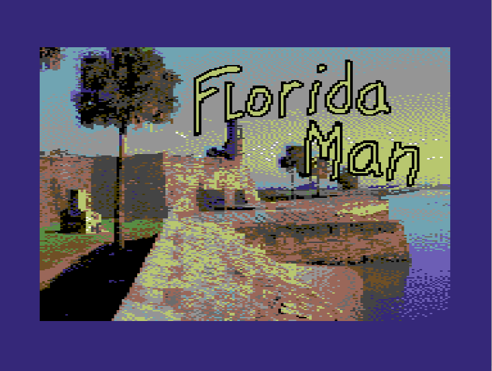
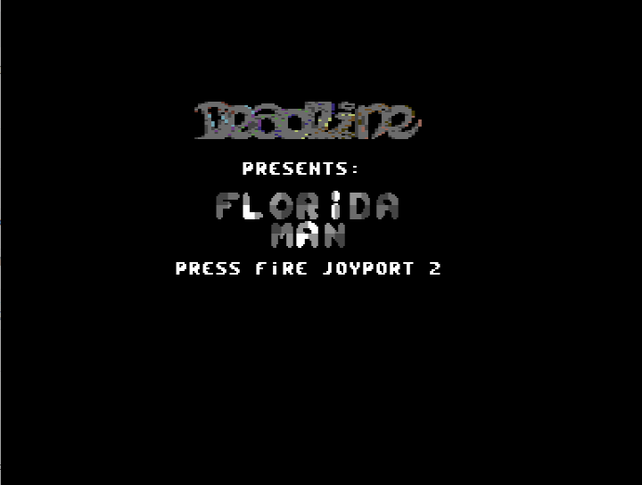

Florida Man
===========

Live the life of adventure. Play your favorite Florida Man adventures as seen in the internet. You want to jump into the crocodile pit? Sure, go for it. You want to break IN to jail to hang with your friends? Nothing is off limits for Florida Man.

This is the Commodore 64 version. Maybe more platforms will come in the future.
Last update: April 7, 2019

Developer Tools
===============
Instructions for getting the source code to compile.

- Firstly, you will also need to have the https://github.com/sethcoder/ddl_asm_c64 repo  installed locally. The Directory structure should look like this:

        -ParentFolderDoesNotMatterWhereItIsLocated/
            - ddl_asm_c64/
                This is where the Deadline C64 Assembly Library repo should reside
            - floridaman/
                This is where the floridaman repo should reside

- Kick Assembler v5.5: http://www.theweb.dk/KickAssembler This requires java in order to work.

    You can configure KickAssembler to automatically start Vice after a compile, and it will start the program immediately.

    First, locate the file: KickAss.cfg in the KickAss folder

    Edit the KickAss.cfg and make sure it looks like this:

            -showmem
            -execute "X:\Your\Path\To\WinVICE-3.0-x64\x64.exe"

    That's it! Now it will load the compiled program into vice and run it once it is finished compiling.

Optional tools:
- Vice v3.0+: http://vice-emu.sourceforge.net/ 
- Sprite Pad v1.8.1: https://csdb.dk/release/?id=100657 Homepage: http://www.subchristsoftware.com/spritepad.htm Note: Export as PRG file, the location doesn't matter as KickAss reassigns the start memory.
- VChar64 v0.2.4: https://csdb.dk/release/?id=154949 Note: Export as ASM. In order to get this file to work with KickAss you must edit the file it creates and change all of the ; (for ASM comments) to // (for KickAss comments) You may also wish to change the file extension from .s to .asm (not sure if that matters or not).
- droiD64 v0.15b: https://csdb.dk/release/?id=172082 This will allow you to construct .D64 images.
- VSCode: The best code editor EVER made. Period. And it is free. https://code.visualstudio.com/
- VSCode Kick Assembler (C64) v0.0.2 Plugin: Just search for it in the extension store in VSCode and install it. You'll need to configure one setting for the path to Kick Assembler jar file, and optionally configure a Keyboard Shortcut to the Kick Assembler: Build function that it adds to the VSCode Command Palette, or just invoke the Kick Assembler: Build directly into the Command Palette.
    
More to come, standby.

Seth aka Deadline
