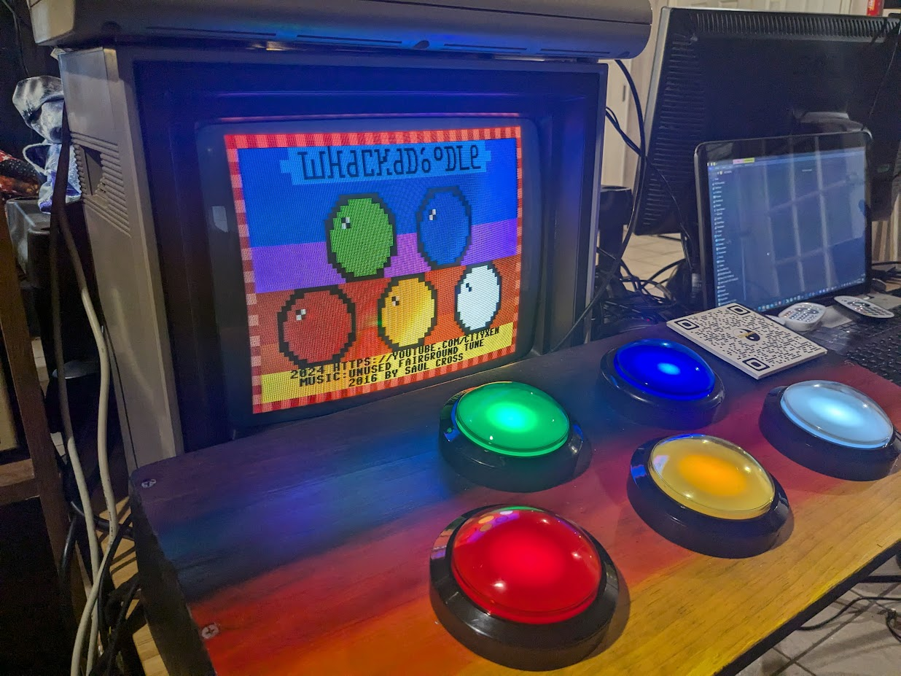
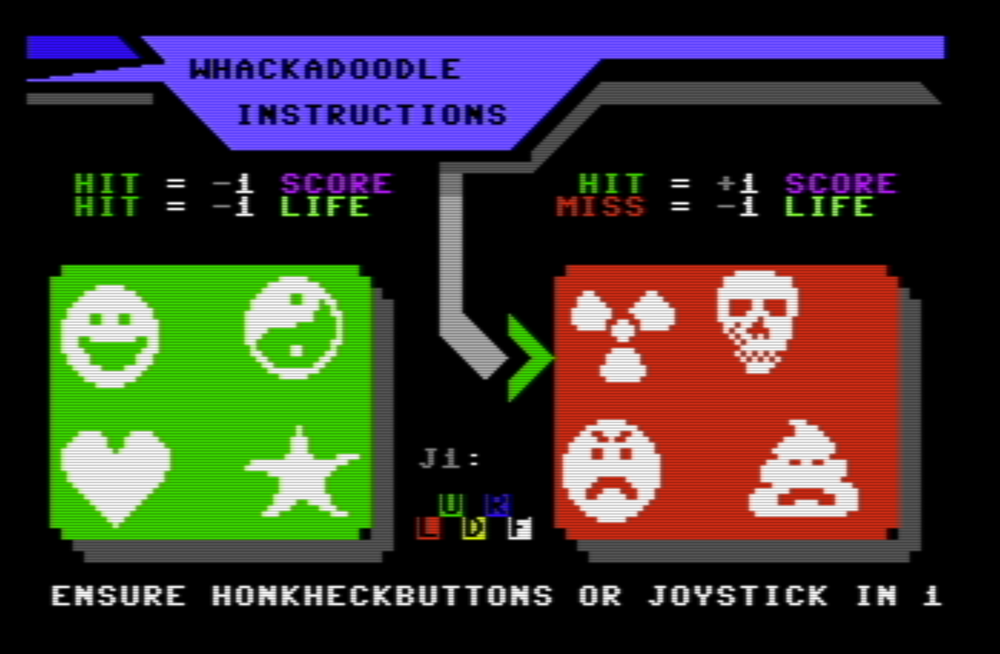
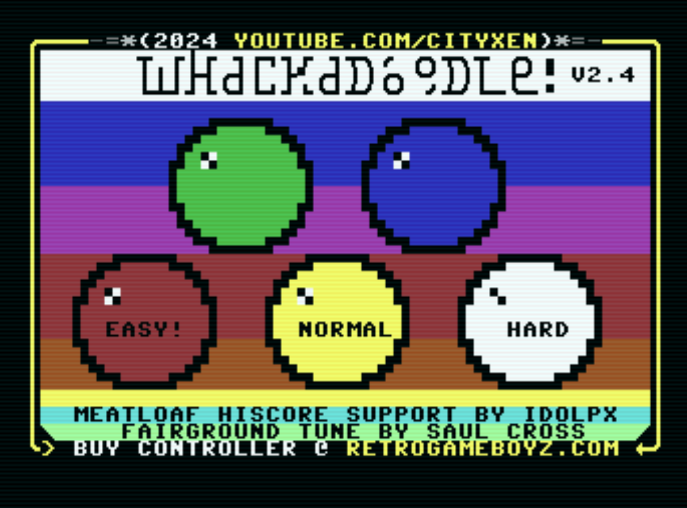
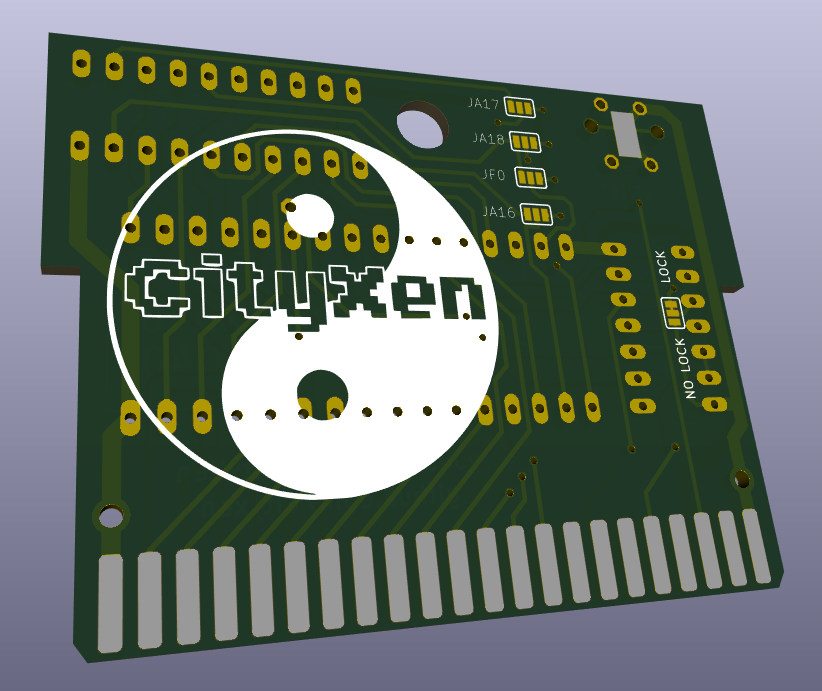
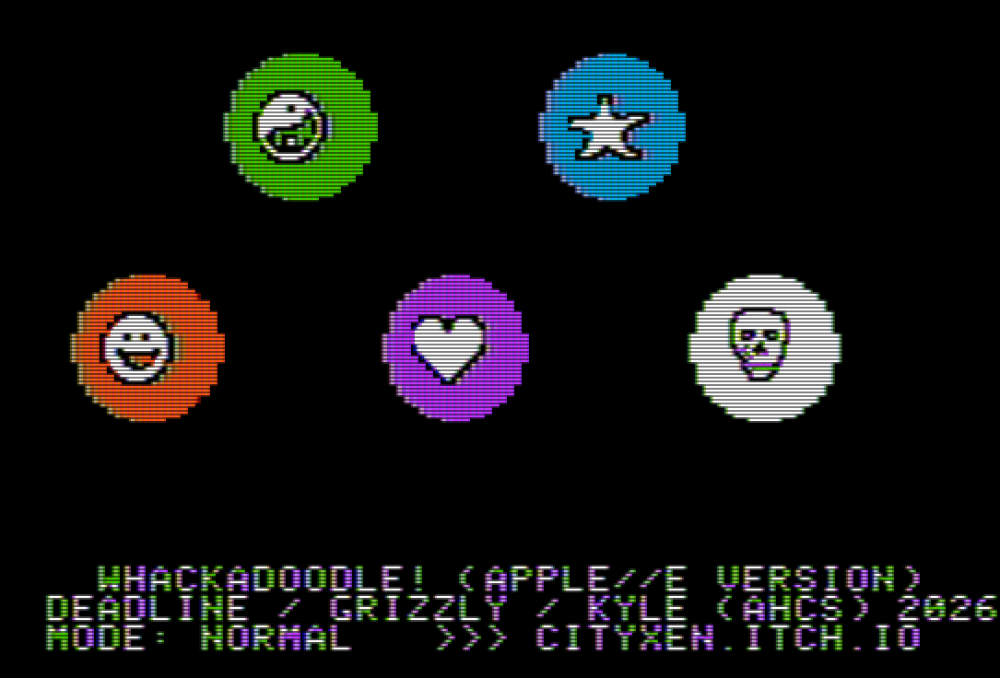
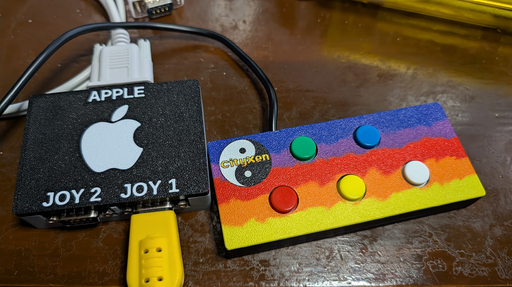
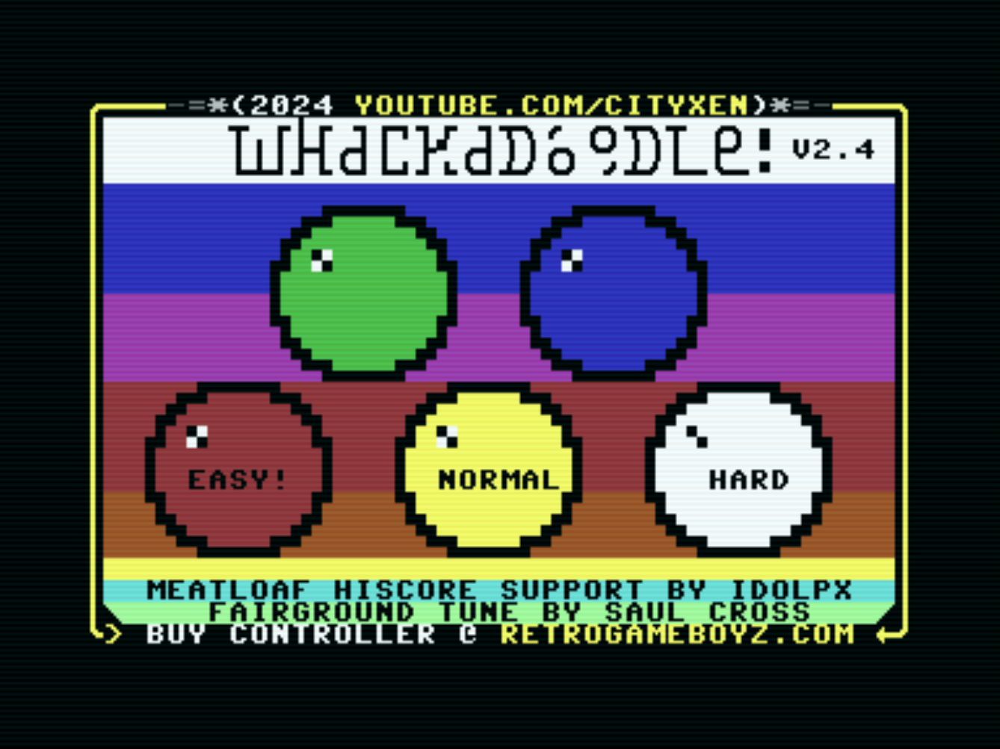

# Whackadoodle!

**The whack-a-mole style arcade game with a CityXen twist!**

A fast, colourful reaction game by **Deadline / CityXen**. Doodles pop up on five
glowing buttons — smash the *bad* ones for points, but keep your hands off the
*good* ones or it'll cost you. Built for real retro hardware (and big arcade
buttons), now being ported across the 8-bit family.

---

## How to play

A doodle appears on one of the five coloured buttons at random. Hit the matching
button **only when a bad doodle is showing**:

- **Hit a BAD doodle** → **+1 score** (POW!)
- **Hit a GOOD doodle** → **−1 score** and **−1 life** (WRONG!)
- **Hit the wrong button** → **−1 life** (MISS)
- **Let a BAD doodle time out** → **−1 life**

The longer you play, the faster the doodles come. Survive as long as your lives
hold out and rack up the highest score you can.

### The doodles

| Good doodles — *don't hit!* | Bad doodles — *whack 'em!* |
| --- | --- |
| 😀 Happy face · ☯ Yin-yang · ❤ Heart · ⭐ Star | ☢ Radioactive · 💀 Skull · 😠 Mad face · 💩 Poo |

### Difficulty modes

| Mode | Lives | Speed | Doodles |
| --- | --- | --- | --- |
| **Easy** | 10 | Slow, no ramp-up | Only bad doodles (no traps) |
| **Normal** | 6 | Speeds up with score (40 / 80 / 99 pts) | Good + bad mix |
| **Hard** | 3 | Full speed from the start | Good + bad mix |

### Controls

Play with a joystick, or for the full arcade experience, a set of five big
lit-up buttons (Red, Green, Yellow/Purple, Blue, White) wired into the machine.

---

## Ports

Whackadoodle started on the Commodore 64 and is being brought to the rest of the
8-bit family. Each port lives in its own folder.

### Commodore 64 — *complete (v2.4)*

The original release, with cartridge support and online **Meatloaf** high scores.

`c64/`

### Apple IIe — *work in progress*

HGR mixed-mode port driven by the Apple game port, with a custom joystick
adapter and a CityXen rainbow button controller.

`appleiie/`

### PC — *work in progress*

A modern build in the Godot engine, faithful to the 8-bit look.

`PC/`

### Atari 800XL — *work in progress*

In development — screenshots coming soon.

`atari800xl/`

---

## Credits

- Game by **Deadline** / CityXen (2024)
- Cartridge code & Meatloaf high-score support by **Jaime Idolpx** (idolpx)
- Fairground tune by **Saul Cross**
- Apple IIe port by **Deadline / Grizzly (David) / Kyle** (AHCS), 2026
- Thanks to **Logg** & the **Atlanta Historical Computing Society (AHCS)** for
  support, hardware help, and play testing

## Links

- 🎮 [cityxen.itch.io](https://cityxen.itch.io)
- ▶ [youtube.com/cityxen](https://youtube.com/cityxen)
